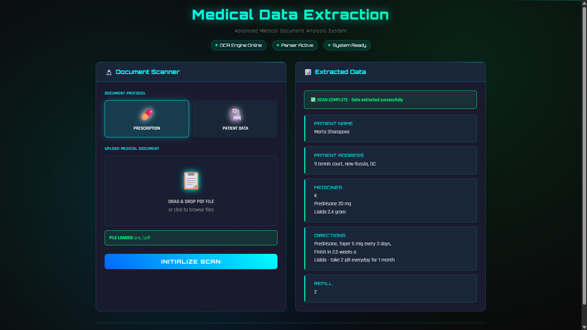

# Medical Document OCR System 🏥

> **Advanced Medical Document Analysis System** - Automated extraction of structured data from medical documents using computer vision and OCR technology.

[](https://python.org)
[](https://fastapi.tiangolo.com)
[](https://github.com/tesseract-ocr/tesseract)
[](https://opencv.org)
[](LICENSE)

## 🌟 Project Overview

This project demonstrates a complete end-to-end solution for automated medical document processing. Built as a learning exercise in computer vision, web development, and healthcare technology integration.

**🎯 What it does:** Converts unstructured medical PDFs into structured, searchable data through advanced OCR and intelligent parsing algorithms.

### ✨ Key Features

- **🔍 Intelligent OCR Processing** - Tesseract-powered text extraction with OpenCV preprocessing
- **🏥 Medical Document Support** - Specialized parsers for prescriptions and patient records
- **🚀 Modern Web Interface** - Cyberpunk-themed responsive UI with drag-and-drop functionality
- **⚡ Real-time Processing** - Asynchronous file handling with live progress indicators
- **🧪 Comprehensive Testing** - Full pytest suite with fixture-based test data
- **🔒 Secure File Handling** - Temporary file processing with automatic cleanup

## 🖥️ Interface Preview

### Main Dashboard


*Interface with dual-panel layout for scanning and results*

### Live Data Extraction


*Real-time extraction of prescription data with structured field parsing*


*Patient demographic and medical history data extraction*

## 🏗️ System Architecture

```
Medical-Document-OCR/
├── backend/
│   ├── src/
│   │   ├── main.py                 # FastAPI application entry point
│   │   ├── extractor.py            # Core OCR processing engine
│   │   ├── parser_generic.py       # Abstract parser base class
│   │   ├── parser_prescription.py  # Prescription document parser
│   │   ├── parser_patient_details.py # Patient record parser
│   │   └── util.py                 # Image preprocessing utilities
│   └── test/
│       ├── test_parser_prescription.py
│       └── test_patient_details_parser.py
├── frontend/
│   └── index.html                  # Cyberpunk-themed web interface
├── resources/
│   ├── prescription/               # Sample prescription documents
│   └── patient_details/            # Sample patient records
└── images/                         # UI screenshots and documentation
```

## 🛠️ Technical Implementation

### Backend Stack
- **FastAPI** - Modern async web framework for API development
- **Tesseract OCR** - Google's open-source OCR engine
- **OpenCV** - Computer vision library for image preprocessing
- **pdf2image** - PDF to image conversion with Poppler backend
- **Python 3.8+** - Core programming language with type hints

### Frontend Stack
- **Vanilla JavaScript** - Pure JS for maximum performance
- **CSS3 with Custom Properties** - Advanced styling with CSS variables
- **HTML5 File API** - Drag-and-drop file upload functionality
- **Responsive Design** - Mobile-first approach with CSS Grid

### Image Processing Pipeline
1. **PDF Conversion** - Multi-page PDF to image conversion
2. **Preprocessing** - Grayscale conversion and adaptive thresholding
3. **OCR Processing** - Tesseract text extraction with language optimization
4. **Data Parsing** - Regex-based field extraction with validation

## 🚀 Quick Start

### Prerequisites
```bash
# Install system dependencies
- Python 3.8+
- Tesseract OCR
- Poppler (for PDF processing)
```

### Installation
```bash
# Clone the repository
git clone https://github.com/spj114/Medical-Document-Ocr.git
cd Medical-Document-Ocr

# Install Python dependencies
pip install -r requirements.txt

# Set up environment variables
cp .env.example .env
# Configure TESSERACT_PATH and POPPLER_PATH in .env
```

### Running the Application
```bash
# Start the FastAPI backend
cd backend/src
python main.py

# Open frontend in browser
cd ../../frontend
# Open index.html in your browser or serve with a local server
```

The API will be available at `http://127.0.0.1:8000` with automatic documentation at `/docs`.

## 📋 Supported Document Types

### 1. Medical Prescriptions
**Extracted Fields:**
- Patient Name
- Patient Address  
- Prescribed Medications
- Dosage Instructions
- Refill Information

### 2. Patient Records
**Extracted Fields:**
- Patient Demographics
- Contact Information
- Medical History
- Vaccination Records
- Emergency Contacts

## 🧪 Testing

Run the comprehensive test suite:

```bash
# Run all tests
pytest backend/test/

# Run with coverage
pytest backend/test/ --cov=backend/src

# Run specific test file
pytest backend/test/test_parser_prescription.py -v
```

**Test Coverage:**
- Parser functionality validation
- Edge case handling
- Data extraction accuracy
- Error handling scenarios

## 🔧 API Documentation

### POST `/extract_from_doc`
Extract structured data from uploaded medical documents.

**Parameters:**
- `file_format`: Document type (`prescription` | `patient_details`)
- `file`: PDF file upload

**Response:**
```json
{
  "patient_name": "John Doe",
  "patient_address": "123 Medical St, Healthcare City",
  "medicines": "Medication details...",
  "directions": "Usage instructions...",
  "refill": "2"
}
```

## 🎨 Design Philosophy

The interface employs a **cyberpunk aesthetic** with:
- **Neon color palette** - Cyan, green, and blue accent colors
- **Futuristic typography** - Orbitron and Rajdhani font families
- **Animated elements** - Scanning lines, glowing borders, pulse effects
- **Responsive layout** - CSS Grid with mobile-first approach
- **Intuitive UX** - Drag-and-drop uploads with visual feedback

## 🔍 Key Learning Outcomes

This project demonstrates proficiency in:

- **Computer Vision** - Image preprocessing and OCR integration
- **Backend Development** - RESTful API design with FastAPI
- **Frontend Development** - Modern CSS and vanilla JavaScript
- **Software Architecture** - Modular design with abstract base classes
- **Testing Methodologies** - Unit testing with pytest and fixtures
- **Documentation** - Comprehensive code documentation and README

## 🚧 Future Enhancements

- [ ] **Machine Learning Integration** - Custom neural networks for improved accuracy
- [ ] **Multi-language Support** - OCR support for non-English medical documents
- [ ] **Database Integration** - PostgreSQL backend for extracted data storage
- [ ] **User Authentication** - Secure login system for healthcare professionals
- [ ] **Batch Processing** - Multiple document processing capabilities
- [ ] **Export Functionality** - JSON, CSV, and XML export options

## 🤝 Contributing

This is a portfolio/learning project, but feedback and suggestions are welcome!

1. Fork the repository
2. Create a feature branch (`git checkout -b feature/enhancement`)
3. Commit your changes (`git commit -m 'Add enhancement'`)
4. Push to the branch (`git push origin feature/enhancement`)
5. Open a Pull Request

## 📄 License

This project is licensed under the MIT License - see the [LICENSE](LICENSE) file for details.

## 🙏 Acknowledgments

- **Tesseract OCR Team** - For the powerful open-source OCR engine
- **FastAPI Community** - For the excellent web framework
- **OpenCV Contributors** - For computer vision capabilities
- **Healthcare IT Community** - For inspiration and use case insights

---

<div align="center">


*Demonstrating the intersection of healthcare, technology, and user experience design*

[](https://github.com/spj114)

</div>